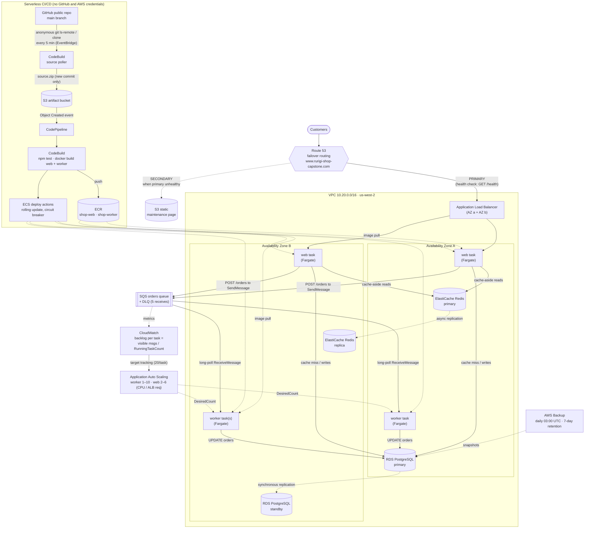

```mermaid
flowchart TB
  user([Customers]) --> r53{{"Route 53<br/>failover routing<br/>www.rurigi-shop-capstone.com"}}
  r53 -->|"PRIMARY<br/>(health check: GET /health)"| alb
  r53 -.->|"SECONDARY<br/>when primary unhealthy"| s3site[("S3 static<br/>maintenance page")]

  subgraph vpc["VPC 10.20.0.0/16 · us-west-2"]
    alb["Application Load Balancer<br/>(AZ a + AZ b)"]

    subgraph aza["Availability Zone A"]
      webA["web task<br/>(Fargate)"]
      workerA["worker task<br/>(Fargate)"]
      rdsP[("RDS PostgreSQL<br/>primary")]
      redisP[("ElastiCache Redis<br/>primary")]
    end
    subgraph azb["Availability Zone B"]
      webB["web task<br/>(Fargate)"]
      workerB["worker task(s)<br/>(Fargate)"]
      rdsS[("RDS PostgreSQL<br/>standby")]
      redisR[("ElastiCache Redis<br/>replica")]
    end

    alb --> webA & webB
    webA & webB -->|"cache-aside reads"| redisP
    webA & webB -->|"cache miss / writes"| rdsP
    rdsP -.->|"synchronous replication"| rdsS
    redisP -.->|"async replication"| redisR
    workerA & workerB -->|"UPDATE orders"| rdsP
  end

  webA & webB -->|"POST /orders to SendMessage"| sqs[["SQS orders queue<br/>+ DLQ (5 receives)"]]
  sqs -->|"long-poll ReceiveMessage"| workerA & workerB

  cw["CloudWatch<br/>backlog per task =<br/>visible msgs / RunningTaskCount"] -->|"target tracking (20/task)"| aas["Application Auto Scaling<br/>worker 1–10 · web 2–6 (CPU / ALB req)"]
  sqs -.->|metrics| cw
  aas -.->|"DesiredCount"| workerA & workerB

  backup["AWS Backup<br/>daily 03:00 UTC · 7-day retention"] -.->|snapshots| rdsP

  subgraph cicd["Serverless CI/CD (no GitHub and AWS credentials)"]
    gh["GitHub public repo<br/>main branch"] -->|"anonymous git ls-remote / clone<br/>every 5 min (EventBridge)"| poller["CodeBuild<br/>source poller"]
    poller -->|"source.zip (new commit only)"| s3src[("S3 artifact bucket")]
    s3src -->|"Object Created event"| cp["CodePipeline"]
    cp --> cb["CodeBuild<br/>npm test · docker build web + worker"]
    cb -- push --> ecr[("ECR<br/>shop-web · shop-worker")]
    cb --> deploy["ECS deploy actions<br/>rolling update, circuit breaker"]
  end
  deploy -.-> webA & webB & workerA & workerB
  ecr -.->|"image pull"| webA & workerB
```
